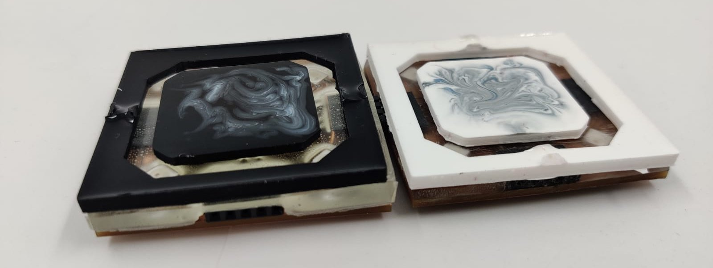

# Connected tiles

## Description

A set of square tiles that can be assembled to form a connected grid. The tiles can be used to create a board game to play tic-tac-toe, checkers, chess, or any other game that can be played on a square grid. A motherboard gathers information from the tiles and sends it to a computer via USB.

## Tiles

### Requirements

A tile must be able to:
- Connect to other tiles using a magnetic connection, know which tiles are connected to them, and where the connected tile is located (**4 pins, 1 per direction**).
- Communicate with the motherboard via I2C (**8 pins, 2 per direction**).
- Receive power from the motherboard and power the connected tiles (**8 pins, 2 per direction**).
- Display an animation or a status color using neopixels.
- Detect which piece is on top of it using a hall effect sensor.

### Piece detection

- 1D Hall effect sensor
- Color sensor
- RFID
- Capacitive sensor
- 3D Hall effect sensor
- LC Resonance

### Components

**MCU**
- ATMEGA328P-AN [(1)](https://www.digikey.com/en/products/detail/microchip-technology/ATMEGA328P-AN/2357082) [(2)](https://ww1.microchip.com/downloads/en/DeviceDoc/ATmega48A-PA-88A-PA-168A-PA-328-P-DS-DS40002061B.pdf)
- ATMEGA328-AU [(1)](https://www.digikey.com/en/products/detail/ATMEGA328-AU/ATMEGA328-AU-ND/2271029)

**Crystal**
- 830108207209 CFPX-180 [(1)](https://www.digikey.com/en/products/detail/w%C3%BCrth-elektronik/830108207209/13900466)
- 20MHz HC49USM-FF3F18 [(1)](https://www.digikey.com/en/products/detail/ilsi/HC49USM-FF3F18-20-000MHZ/12619607)

**Neopixels**
- SK6812 [(1)](https://cdn-shop.adafruit.com/product-files/1138/SK6812+LED+datasheet+.pdf)
- WS2812B [(1)](https://cdn-shop.adafruit.com/datasheets/WS2812B.pdf)

**Hall effect sensor**
- DRV5053EA [(1)](https://www.digikey.com/en/products/detail/texas-instruments/DRV5053EAQDBZR/5015735)
- A1301 [(1)](https://media.digikey.com/pdf/Data%20Sheets/Allegro%20PDFs/A1301,02.pdf)
- DRV5056ZAQDBZR [(1)](https://www.mouser.fr/ProductDetail/Texas-Instruments/DRV5056Z4QDBZR?qs=sGAEpiMZZMu5vlrqIFXt5bBKj94x8jjB1VhsLdgRjqTXdlweh5XYMA%3D%3D)

**Connection pins**
- Pogo pins [(1)](https://www.digikey.com/en/products/detail/mill-max-manufacturing-corp/829-22-020-20-002101/4007088) [(2)](https://www.mouser.com/ProductDetail/Mill-Max/854-22-003-20-001101?qs=XFe3dyCRgQjPe3AesOqKJA%3D%3D) [(3)](https://fr.aliexpress.com/item/1005003579709688.html) [(4)](https://www.digikey.com/en/products/detail/mill-max-manufacturing-corp/829-22-003-20-001101/2416224)
- U Shape Pin headers [(1)](https://www.wayconn.com/ph254-1u26/) [(2)](https://fr.aliexpress.com/i/32992671943.html) [(3)](https://www.digikey.com/en/products/detail/aries-electronics/16-675-191/4208672)

**Mating targets**
- 399-10-164-10-008000 [(1)](https://www.digikey.com/en/products/detail/mill-max-manufacturing-corp/399-10-106-10-008000/4456257)

**Magnets**
- 8195 (6.35mm x 1.59mm) [(1)](https://www.digikey.com/en/products/detail/radial-magnets-inc/8195/555329)
- 5mm x 1mm neodymium magnets [(1)](https://www.magnetiques.fr/magnetique,aimant-rond-plat-552-fr.html)
  Magnet strength and Gauss calculator [here](https://www.kjmagnetics.com/calculator.asp)

**Reset tactile switch**
- TS04-66-43-BK-100-SMT [(1)](https://www.digikey.com/en/products/detail/cui-devices/TS04-66-43-BK-100-SMT/15634299)

**Capacitors**
- Crystal: 12pf 0603 0603N120J500CT [1](https://www.digikey.com/en/products/detail/walsin-technology-corporation/0603N120J500CT/9354977)
- Hall effect sensor: 12pf 0603 0603N120J500CT [1](https://www.digikey.com/en/products/detail/walsin-technology-corporation/0603N120J500CT/9354977)

**Resistors**
- Neopixels: 300 Ohm 0603 RC0603JR-07300RL [1](https://www.digikey.com/en/products/detail/yageo/RC0603JR-07300RL/726765)
- Pull-up reset resistor: 10k Ohm 0603 RNCP0603FTD10K0 [1](https://www.digikey.com/en/products/detail/stackpole-electronics-inc/RNCP0603FTD10K0/2240139)

**LED**
- B1931UD--05D000314U1930 [(1)](https://www.digikey.com/en/products/detail/harvatek-corporation/B1931UD-05D000314U1930/15861266)

### Tile detection mechanism

When the tiles are powered up, their "connection" pins are set as Outputs and are set to HIGH...

### Pieces

A piece category is defined by the magnetic field it generates. For example, in chess, the pieces are:
- Pawn: 1 magnet
- Rook: 2 magnets
- Knight: 3 magnets
- Bishop: 4 magnets
- Queen: 5 magnets
- King: 6 magnets
